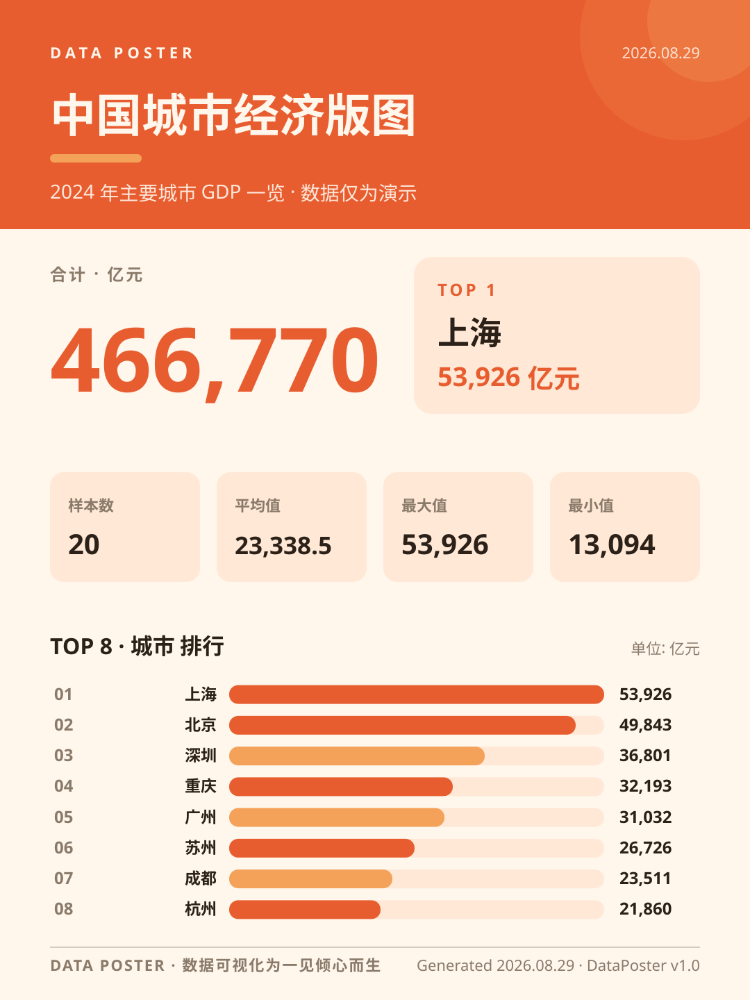
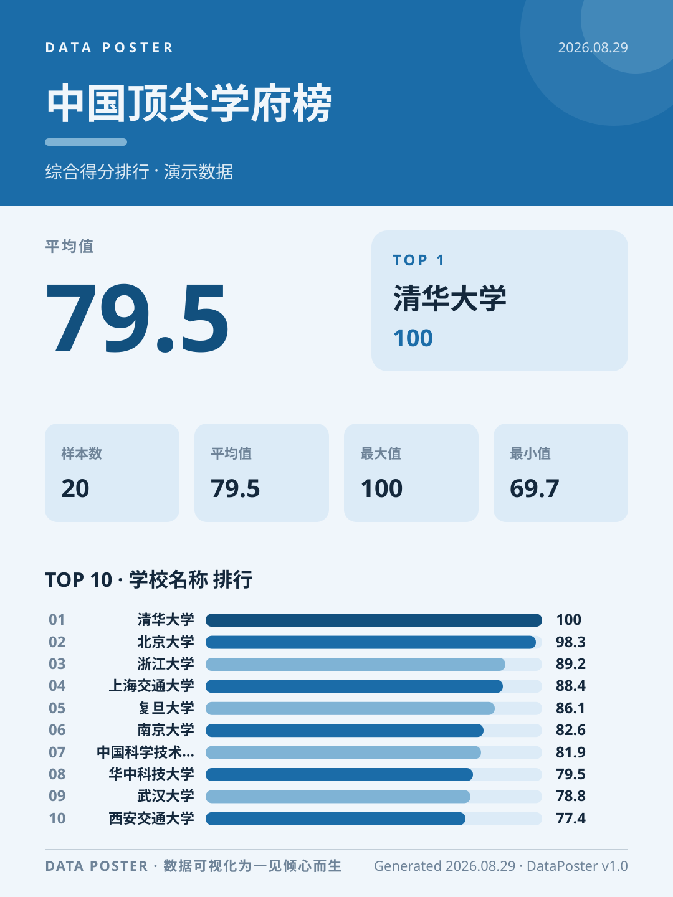
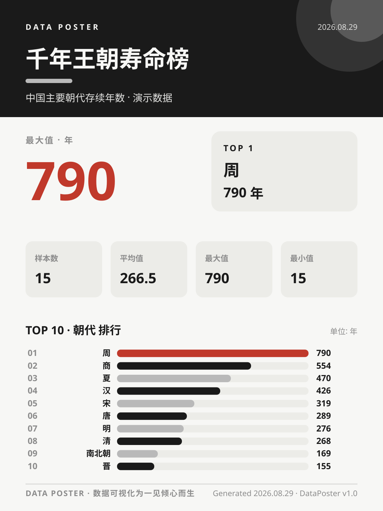
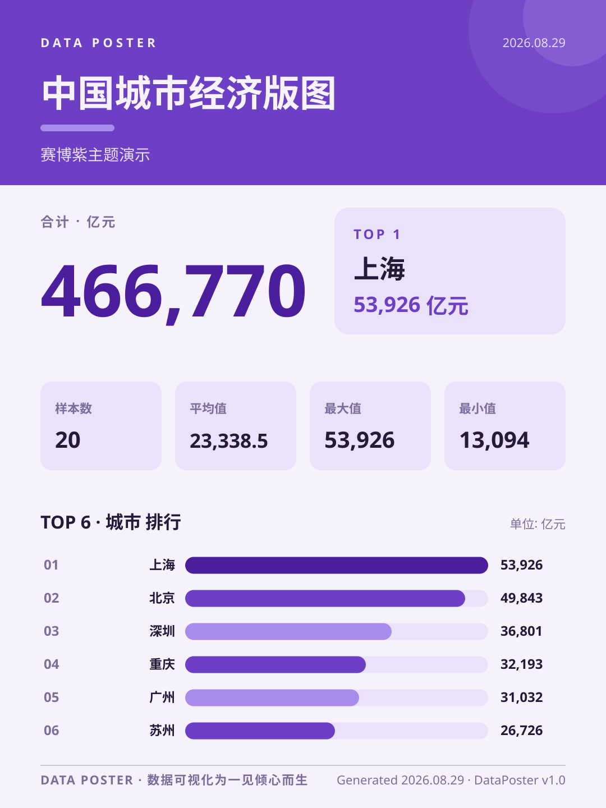
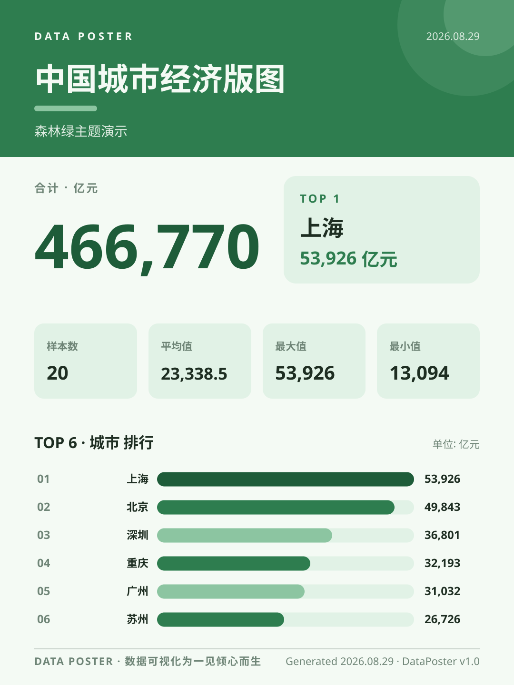
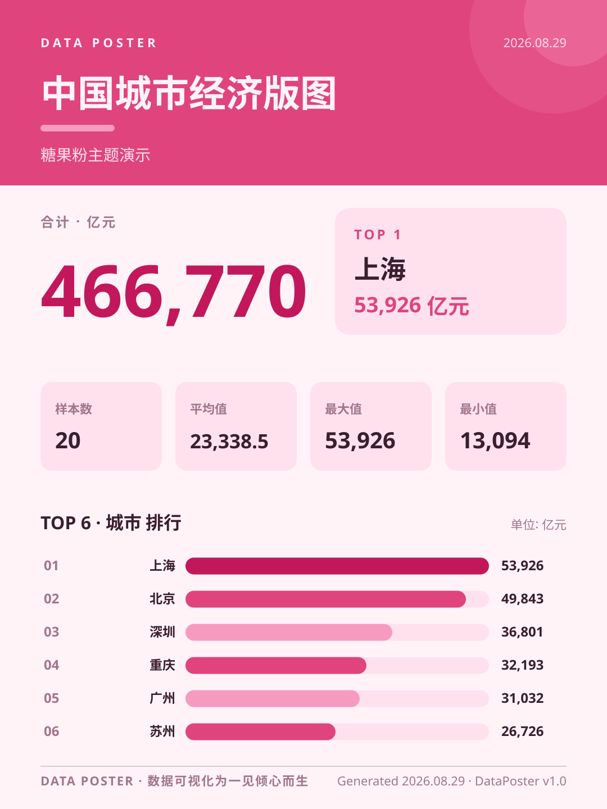

<p align="center">
  
</p>

<h1 align="center">DataPoster · 一键把数据变杂志风信息图海报</h1>

<p align="center">
  <em>把任何 CSV 文件丢给它，它替你识别标签、算出数字、排好版，最后吐出一张可以直接发小红书 / 微博 / 公众号封面 / 课堂展示的杂志风 SVG 海报。</em>
</p>

<p align="center">
  <a href="#-30-秒上手">30 秒上手</a> · <a href="#-命令速查">命令速查</a> · <a href="#-主题画廊">主题画廊</a> · <a href="#-python-api">Python API</a> · <a href="#-项目结构">项目结构</a>
</p>

---

## 它是什么

**DataPoster** 是一个零依赖（只用 Python 标准库）的命令行小工具，专治这种日常痛点：

> *「我手头有一份表格数据，想发到社交媒体上炫耀 / 写进周报 / 当课堂报告封面——但 PPT/Excel 排出来的图死板难看，请设计师又太重。」*

只要数据是 CSV 格式——课程成绩、城市指标、销售流水、读书清单、奶茶店月度销量——**一条命令**就能得到一张：

- 顶部杂志封面式标题色块
- 一个超大数字抓住视线
- 一张 TOP 1 高光卡片
- 四个统计指标卡（样本数 / 均值 / 最大 / 最小）
- 一组排行榜色带
- 一行生成时间戳页脚

输出的是 **SVG 矢量图**，任意缩放都不糊；可以截图发小红书、嵌进 Markdown、导出 PDF、或者直接挂到 GitHub README 上当封面。

---

## 30 秒上手

> Python ≥ 3.8，不需要 `pip install` 任何东西。

```bash
# 1) 进入项目
cd DataPoster

# 2) 直接跑：把 examples/cities_gdp.csv 变成一张海报
python -m dataposter examples/cities_gdp.csv --theme sunset

# 3) 海报已经躺在 output/ 目录里了
# 浏览器打开就能看 / 截图就能发
```

> 💡 Windows 用户：在 PowerShell、CMD、Git Bash 任意一种里跑都行。

### 最常用的 5 个参数

```bash
python -m dataposter <csv文件> \
    --theme   sunset                 # 选一个主题色（见下方画廊）\
    --title   "中国城市经济版图"       # 海报主标题\
    --subtitle "2024 主要城市 GDP"    # 海报副标题\
    --top     8                      # 条形图显示前 N 条\
    --metric  total                  # 超大数字显示什么（total/mean/max/min/std/count）\
    -o        out/my.svg             # 指定输出文件
```

更多参数（指定列、选择单位）见下方「命令速查」。

---

## 效果展示

| 主题 | 海报 |
| :---: | :---: |
| **sunset** 落日橘 |  |
| **ocean**  深海蓝 |  |
| **ink**    水墨黑 |  |
| **cyber**  赛博紫 |  |
| **forest** 森林绿 |  |
| **candy**  糖果粉 |  |

> 同一份「中国城市 GDP」数据切换 6 个主题，相当于免费拿到一整套设计资产。

---

## 主题画廊

每个主题都是手挑的杂志配色，按"信息层+视觉层"分工：

| 主题 | bg 底色 | 主色 | 适合场景 |
| :--- | :---: | :---: | :--- |
| `sunset` 落日橘 | `#FFF6EC` | `#E85D2F` | 城市榜单 / 消费数据 / 节日复盘 |
| `ocean`  深海蓝 | `#F0F6FB` | `#1B6CA8` | 学术报告 / 财报 / 严肃议题 |
| `forest` 森林绿 | `#F4FAF4` | `#2E7D4F` | 行业盘点 / 生态主题 / 低调优雅 |
| `ink`    水墨黑 | `#F7F7F5` | `#1A1A1A` | 极简主义 / 文化主题 / 公众号封面 |
| `candy`  糖果粉 | `#FFF3F8` | `#E0447C` | 个人作品 / 少女风 / 节日海报 |
| `cyber`  赛博紫 | `#F5F2FC` | `#6C3FC5` | 科技话题 / Web3 / 酷炫节奏 |

新增主题？打开 [`dataposter/themes.py`](dataposter/themes.py) 加一行 dict 即可，零改动业务代码。

---

## 命令速查

### 基本语法

```text
python -m dataposter <CSV 文件> [选项]
```

### 全部参数

| 参数 | 默认 | 说明 |
| :--- | :---: | :--- |
| `csv` | 必填 | 数据文件路径，自动识别 UTF-8 / GBK 编码 |
| `-o / --output` | `output/<文件名>_<主题>.svg` | 输出文件路径 |
| `-t / --title` | 取自列名 | 海报主标题（≤18 字自动缩字号） |
| `-s / --subtitle` | 无 | 海报副标题 |
| `--theme` | `sunset` | 主题：`sunset` / `ocean` / `forest` / `ink` / `candy` / `cyber` |
| `--top` | `8` | 条形图显示前 N 条（建议 4-10） |
| `--metric` | `total` | 超大数字内容：`total` / `mean` / `max` / `min` / `std` / `count` |
| `--label` | 自动识别 | 指定标签列名（一般不用） |
| `--value` | 自动识别 | 指定数值列名（一般不用） |
| `--list-themes` | — | 列出所有可用主题 |

### 实战：把 `examples/cities_gdp.csv` 跑成 6 个主题

```bash
for t in sunset ocean forest ink candy cyber; do
  python -m dataposter examples/cities_gdp.csv --theme $t --top 6
done
```

### 自动识别是怎么工作的

工具会扫描每一列，根据「能解析成数字的占比」决定列类型：

- 文本列：第一个文本列当作「标签列」（城市名、学校名、人名……）
- 数值列：有多个数值列时，挑「区分度最高」（标准差最大）的那一列

如果识别错了，强制指定：

```bash
python -m dataposter data.csv --label "城市" --value "常住人口(万人)"
```

### 数值列里写单位更聪明

数值列名写成 `GDP(亿元)` 或 `存续年数(年)` —— 工具会自动把括号里的内容当作单位，渲染在超大数字标签上、TOP 卡片里、条形图右侧。

---

## Python API

不想用命令行？一行代码导入调用：

```python
from dataposter import make_poster

path = make_poster(
    "data/sales.csv",        # CSV 路径
    output="out/sales.svg",  # 可选；不填则自动命名
    title="618 大战战报",     # 必填
    subtitle="2024 复盘",    # 选填
    theme="cyber",           # 选填，默认 sunset
    top=10,                  # 选填，默认 8
    metric="mean",           # 选填，默认 total
    # label="商品名称",      # 选填，覆盖自动识别
    # value="销售额(万元)",  # 选填，覆盖自动识别
)
print("海报已生成:", path)
```

适合集成到：周报脚本、Notebook 里、爬虫数据落地后一键出图、自动化社媒运营。

---

## 项目结构

```text
DataPoster/
├── dataposter/              # 核心代码（包）
│   ├── __init__.py          # 暴露 make_poster() 公共 API
│   ├── __main__.py          # 支持 python -m dataposter 调用
│   ├── analyze.py           # CSV 解析、列识别、统计
│   ├── themes.py            # 6 套主题色板（手挑杂志配色）
│   ├── render.py            # SVG 海报渲染（1080×1440）
│   └── cli.py               # 命令行参数解析与流程编排
├── examples/                # 3 套示例数据，开箱即用
│   ├── cities_gdp.csv       # 2024 主要城市 GDP（20 条）
│   ├── universities.csv     # 顶尖大学综合得分（20 条）
│   └── dynasties.csv        # 中国主要朝代存续年数（15 条）
├── output/                  # 生成的示例海报（可直接在 README 中查看）
│   ├── cities_gdp_sunset.svg
│   ├── cities_gdp_ocean.svg
│   ├── ...
├── .gitignore               # Python 标准忽略项
├── LICENSE                  # MIT
├── README.md                # 你正在读的这份
└── requirements.txt         # 零依赖，仅声明 Python 版本
```

### 代码约定

- 模块名小写下划线，函数名小写下划线，常量大写下划线
- 每个函数都有中文 docstring，**第一行**说人话，**空一行**后讲细节
- 关键分支内嵌一行注释解释「为什么」，而不是「做了什么」
- 公共 API 集中在 `__init__.py`，内部实现不暴露

---

## 安装与开发

### 运行环境

- Python 3.8+
- 任意操作系统（Windows / macOS / Linux）

### 安装（可选）

项目零第三方依赖，绝大多数情况直接克隆就能跑：

```bash
git clone https://github.com/<你的用户名>/DataPoster.git
cd DataPoster

# 可选：扔进虚拟环境
python -m venv .venv
source .venv/bin/activate        # Windows: .venv\Scripts\activate
```

### 跑测试用例

```bash
# 用所有内置示例数据 × 6 个主题做一次烟囱测试
python -m dataposter examples/cities_gdp.csv     --theme sunset
python -m dataposter examples/universities.csv   --theme ocean
python -m dataposter examples/dynasties.csv      --theme ink
```

预期输出：在 `output/` 下各生成 1 个 SVG 文件，命令行打印「TOP 1」和「样本数」。

---

## 工作流

```text
你的 CSV 文件
      │
      ▼
┌────────────────────┐
│  analyze.py        │  →  自动识别标签/数值列
│  (列识别 + 统计)    │  →  计算 total/mean/max/min/top-N
└────────┬───────────┘
         │
         ▼
┌────────────────────┐
│  themes.py         │  →  取一份主题色板
│  (配色字典)         │
└────────┬───────────┘
         │
         ▼
┌────────────────────┐
│  render.py         │  →  按杂志版式拼装 SVG
│  (版面 + 字号)      │  →  自适应字号防止溢出
└────────┬───────────┘
         │
         ▼
   output/*.svg
   (可直接分享)
```

---

## Roadmap

- [ ] 饼图 / 玫瑰图 / 折线图小部件
- [ ] 横向海报 / 方形海报 / 公众号封面 1080×1260 三种尺寸
- [ ] 中文字体本地化（避免在没装 PingFang 的环境上回退到不好看）
- [ ] 主题市场：让社区通过 PR 贡献新主题
- [ ] 导出 PNG / PDF（命令行 `--export png`）

欢迎 Star & Issue & PR ☕️

---

## 许可证

[MIT](LICENSE) — 自由使用，保留版权信息即可。

---

> Made with 🎨 by an data-lovin' student who wanted `cat data.csv | send-to-boss` to actually look pretty.
